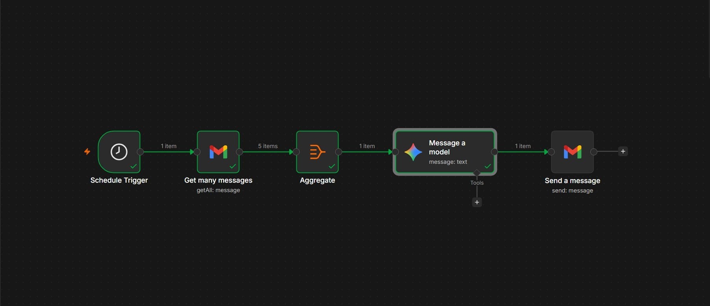

# **Email Summarizer using n8n and Gemini AI**


An automated workflow that reads your Gmail inbox daily, summarizes all emails received in the last 24 hours using Google Gemini AI, and sends a clean HTML summary back to your email.

## **Workflow Preview**

<p align="center">
  
</p>

## Tech Stack

| Technology | Purpose |
|------------|---------|
| n8n | Workflow Automation Platform |
| Gmail API | Reading and Sending Emails |
| Google Gemini | LLM for Summarization |

## How It Works

1. Schedule Trigger runs automatically every day at 7 AM
2. Get Many Messages node fetches all emails received in the last 24 hours
3. Aggregate node compiles email data (Subject, From, To, Cc, Snippet)
4. Gemini AI Model summarizes the emails into clean HTML format
5. Send a Message node emails the summary back to the user

## Setup Instructions

 ### 1. Clone this repository
   ```bash
   git clone https://github.com/hithursan/Email-Summarizer.git
```
### 2. Import the workflow
        Open your n8n instance
        Go to Workflows then Import from File
        Select workflow.json

### 3. Set up credentials
        Gmail OAuth2 (via Google Cloud Console)
        Google Gemini API Key

### 4. Update the recipient email in the Send a Message node

### 5. Activate the workflow in n8n

### 6. Test it by waiting for the scheduled trigger or running it manually to receive your email summary.

## Project Structure
```
email-summarizer/
├── workflow.json              n8n workflow export
├── README.md                  Project documentation
├── .gitignore                 Ignored files
└── images/
    └── workflow-screenshot.png
```
##  Author

**Hithursan Navaretnarasa**

---
<div align="center" font-wight=800>
Crafted with ❤️ for the modern connoisseu#
</div>
    
